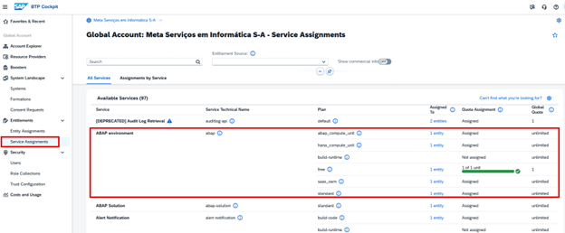
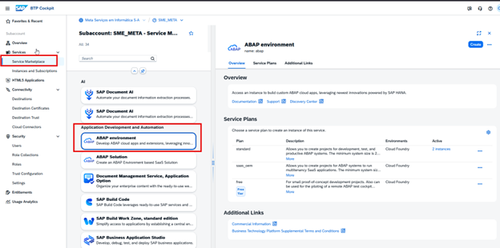
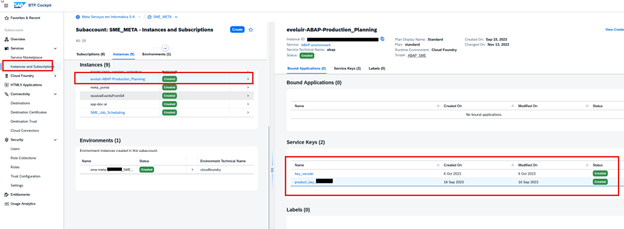

# Configuração da Infraestrutura no BTP Cockpit

A preparação da Subaccount deve ocorrer antes de abrir o ADT].

### 1. Entitlements
Garanta que sua Subaccount tenha cotas para o serviço **SAP BTP ABAP Environment** (plano standard ou free-tier).

### 2. Service Instance e Service Key
* No **Service Marketplace**, crie uma instância do serviço ABAP.
* Durante a criação, utilize um arquivo JSON para definir o administrador inicial.

* Gere uma **Service Key** após criar a instância. Ela contém as URLs e credenciais para o ADT.

### 3. Role Collections
Atribua as funções necessárias ao seu usuário, como `SAP_BR_DEVELOPER` e `SAP_BR_ADMINISTRATOR`.

 
 
Continuar para: [**Software Components**: O papel do gCTS e integração com Git](03-gerenciamento-de-software-components/README.md)
