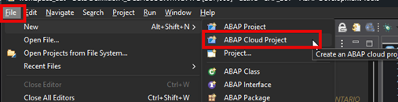
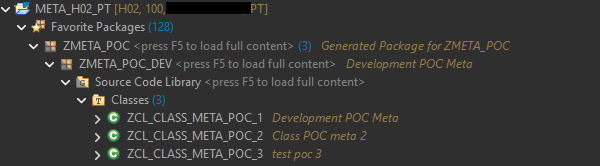

# Desenvolvimento no ADT (Eclipse)

### Conexão e Projetos
Crie um novo **ABAP Cloud Project** utilizando os dados da sua **Service Key** .

### Organização de Pacotes
Localize o pacote gerado automaticamente com o nome do seu Software Component . Todos os objetos devem ser criados sob este pacote ou sub-pacotes .

### Transport Requests (TRs)
Ao criar objetos, o sistema solicitará uma TR . No BTP, as TRs são locais, servindo para agrupar as mudanças que serão "comitadas" no Git .

  
Continuar para: [**Fluxo de Transporte**: Ciclo de vida entre Desenvolvimento e QA/Produção](../05-fluxo-de-transporte-e-git/README.md)
