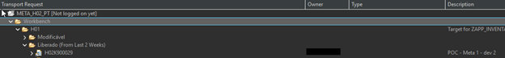
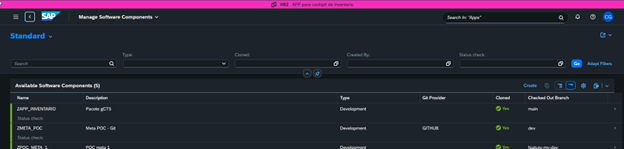
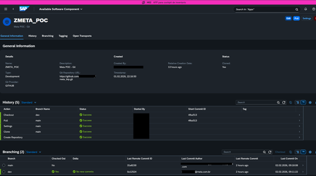
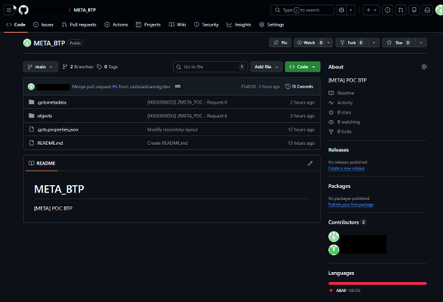
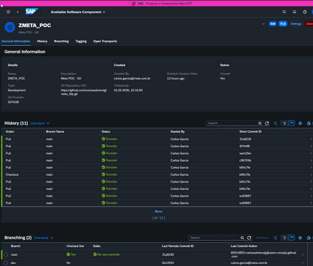

# Fluxo de Transporte via gCTS

O transporte é o ato de levar o código do Git para outro sistema .

### No Ambiente de Desenvolvimento (Push)
1. **Release**: No ADT, libere as tarefas e a Transport Request no **Transport Organizer** .

2. **Push**: Após a liberação, a mudança fica disponível no app **Manage Software Components** .

  

3. **Review**: Realize o processo de revisão e Pull Request no GitHub .

### No Ambiente de Destino (QA/Prod)
1. Abra o app **Manage Software Components** no sistema de destino .
2. Selecione o componente e clique em **Pull** [cite: 60]. Isso baixará a versão mais recente do Git para o sistema local .

O código será então transportado para o ambiente de destino .
